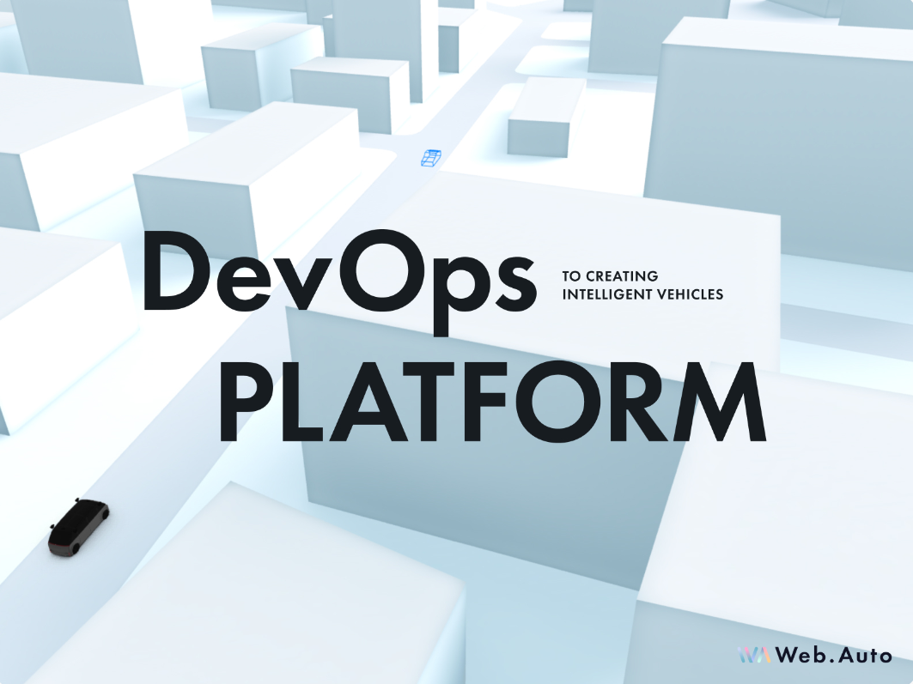
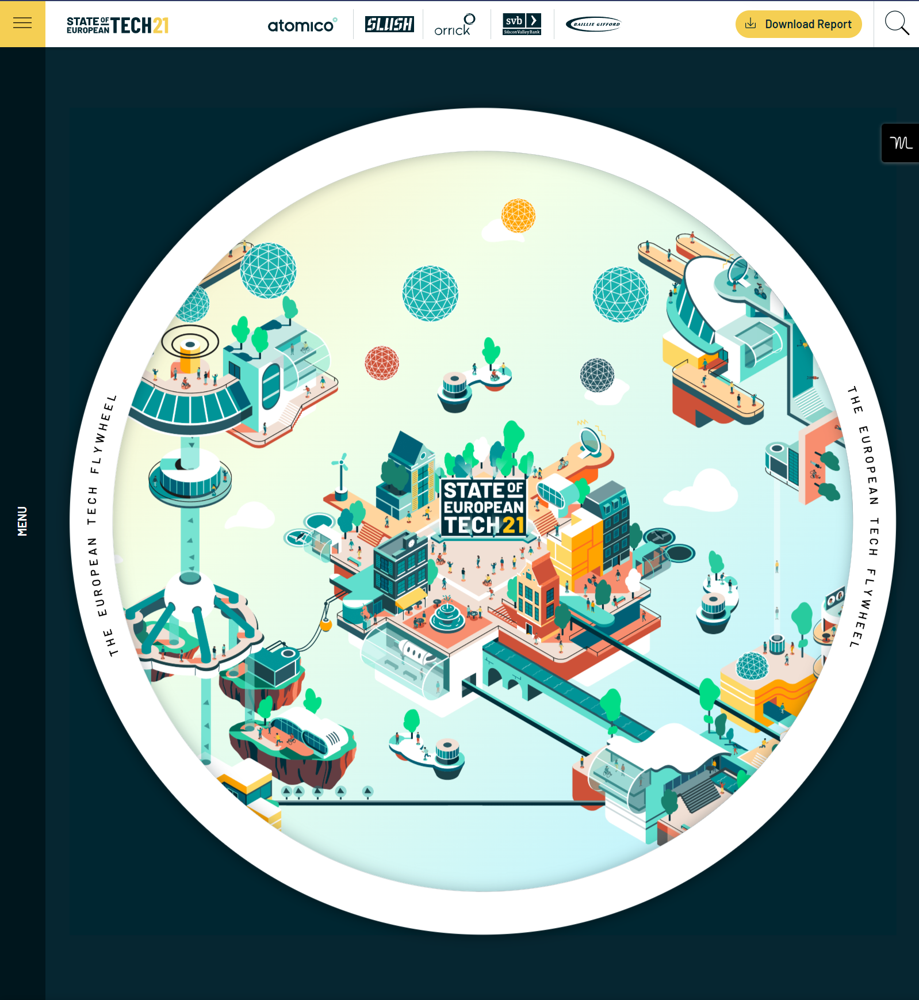
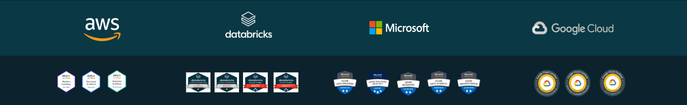
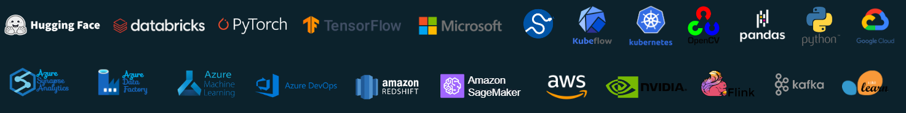

public:: true

- I'm starting to feel more inclined to building the website directly from HubSpot, even. It seems like I can't make any fancy animations. It simplifies the whole process and the true trick behind everything is going to be spot. Is a scalable website with any good sales intelligence..
- [hubspot 1](https://app-eu1.hubspot.com/active-theme-create/26764876/marketplace?redirectUrl=https%3A%2F%2Fapp-eu1.hubspot.com%2Factive-theme-create%2F26764876%2Fcreate-page%2Fsite-page%2Fselect-theme%3Freferrer%3DcontentManager%26referrerUrl%3Dhttps%253A%252F%252Fapp-eu1.hubspot.com%252Fwebsite%252F26764876%252Fpages%252Fsite%252Fall%26siteDomain%3D26764876.hs-sites-eu1.com%26pageName%3Dtest%2520templates%26changeTheme%3Dtrue)
- [WebFlow Diagram based](https://2021.stateofeuropeantech.com/chapter/executive-summary/)
- [WebFlow 2](https://openinnovation.dgrees.studio/es/sobre-nosotros/)
- [Very similar KIltpatrik](https://www.kilpatrickit.com/enterprise/)
- [interesting clean branding for data](https://pulla.digital/about/)
- [Interesting](https://stytch.com/)
- [also a favorite](https://www.dierks.company/)
- [Also a favorite](https://www.2futureholding.com/)
- [Best one maybe](https://clay.earth/)
- [I like the simplicity not the colours](https://nordambusinesspartners.com/)
- [Verry good](https://thecape.agency/)
- [could be this one](https://mioticonsulting.dgrees.studio/data-strategy/)
- [I like the simplicity](https://www.hubble.net/)
- [could be similar](https://unifi.baunfire.com/)
- [I like how it works section neeeds more real pics](https://www.numi.tech/how-it-works)
- [love the branding](https://www.robust.vc/)
- [also good neat layout but no pics](https://www.bosonprotocol.io/)
- [meh no pics nice design](https://www.awwwards.com/sites/sedai)
- [Nice clean style too](https://www.alphabeta.be/)
- [One of my favs](https://viva-fabrica.fr/)
-
- {:height 287, :width 313}
- {:height 340, :width 295}
-
-
- Insight: Zero-Loss entryway for your data and AI journey. Zero-Tolerance for bad
- Aible and (Market Intelligence and Augmented Analytics
-
-
-
- **Lets now look at a potential structure for the homepage off Jigsaw**
- # [[JIGSAW AI]] logo
- ### Subtext: Elite AI Hub
- # Hire pre-vetted, elite Data and AI development teams:
- Share your must urgent requirements and we'll match you with elite software development partners from our vetted network for free in just 72 hours.
-
- ### CTA: Schedule a call
	- Completely free
	- Matched within 72 hours
	- data-drive, risk free
	-
- ## This year the HUB is focusing on solving problems for companies in the areas
	- Waste Management;
	- Energy Efficiency,
	- Factory of the future
	- Supply Chain optimization$
	- (each of the above)
	-
- ## Why work with Jigsaw AI?
	- ### Problem
		- 87% of Data & AI still fail. Companies are scared and being left behind, and outpaced by competitors.
	- ### Solution
		- We de-risk your investment, by pairing you with a team that has a proven track record of solving your exact problem.
		-
	- ## Deep enthusiasm and pragmaticism
		- Top execs and businesses rely on our proprietary due diligence and data driven matching to hire smart partners. Weather its their first entryway to becoming a more data enriched enterprise, or if they already specific problem to be solved, our team analyses the problem and fills the right gap.
	-
		- #### Tailored matches
			- Submit your brief and we'll connect you with a tailored set of perfectly matched partners from our vetted network, guaranteed to have the experience and expertise required to deliver your project or talent needs.
		- #### Zero-trust approach
			- You don't need to take on the risk. Our Data Analytics and AI teams have first been screened by market intelligence tools and then passed through rigorous 4-step application and only 10% make the cut
		- #### Fast Results
			- Engage with an Elite Team from out Hub within days. After 72 hrs of submitting a brief, we carefully match you with engineering teams based on your specific needs
		- #### Zero-Cost approach
			- Our service helps you find and hire qualified professionals without any cost to you. You will work directly with the teams you choose, who will compensate us for getting exact problems their familiar with.
	-
- ## How does it work?
	- Just submit your brief, and receive detailed analysis of prospective teams within 72 hours. It's that easy, and it's free.
	  :LOGBOOK:
	  CLOCK: [2023-01-02 Mon 03:48:48]--[2023-01-02 Mon 03:48:49] =>  00:00:01
	  CLOCK: [2023-01-02 Mon 04:04:39]
	  :END:
		-
		- Step 1: Submit your project specifications to us.
		- Step 2: provide you with information and data about the teams that match your requirements.
		- Step 3: We will provide you with information and data about the teams that match your requirements.
		- Step 4: Choose the team that is right for you, or walk away without any cost.
		  id:: 480ac122-d97a-432b-b192-85a0a8c898f4
		- Step 5: Choose the team that is right for you, or walk away without any cost.
		-
- ### Qoute:
	- "AI is not a solitary pursuit. It requires a diverse team of experts working together to overcome challenges and achieve success." - Gartner
-
- ## Jigsaws hub steady success strategy
	- Together with our rigorous on-boarding process, we work with partners continuously running augmented analytics completely automates the data engineering and data science tasks to ensure a dataset of sufficient quality to generate high-impact teams for each specific problem a business might face. We don't sell technology teams in Data and AI. We sell specific solutions to our partners. Providing them:
		-
		- 3 partners shortlisted for your needs
		- Detailed team overviews and key metrics
		- Vendor shortlist comparison
		- 45 minute consultations with each team
-
-
- ## Deploying the right team for your organization
	- As such we offer large-scale software development projects to small-scale team augmentations, our pre-vetted Hub members, are ready to meet your needs. And depending on your Data-Maturity.
		-
		-
		- Point 1: Team extension
			- Looking to fill internal technical skill gaps?
			- We can add resources to your team with just two weeks' notice.
			- To supercharge your data evolution effort
			-
			- Point 2: Project-based team
				- Start or continue a project at any stage.
				- Where a clear problem or solution has already been identified, new ideas, or for development or extending a product with new features
				-
				- Point 3: Scoping
					- An individual service provided in circumstances where it is too risky to make a specific commitment.
						- Our data architect will visit your site to assess the situation and provide recommendations
-
- ### Tell us your business needs and we’ll show you how we helped others.
-
	- Get started with a discovery call with one our specialists
		- Schedule clall
-
- ##
- ## Jigsaws Hub
- ### An elite software development partner network like no other
-
- ## Problems
	- First its all about understanding what's your problem?
		- Predective Maintenance
		- Supply Chain Optimization
		- Production Process Optimization
		- Customer Recommendations
		- Privacy Protection
		- Human Recognition
		- Scene Analysis and Inspection
		- Human Recognitzion
		- Document Analysis
		- Customer Support
		- Customer Service
		- Automation of workflows
		- Cognitive Search
		- Knowledge Graphs
		- Knowledge Mining
		- ML operations
		- Predictive forecasting
		- Interenet of Things
		- Artificial Intelligence
		- Data pipileine Engineering
		- Cloud platform managent
		- MLops /Devops
	-
-
-
- ## People
	- Only then we can select the best people
		- Solutions Architect
			- The Solution Architect makes sure everyone involved in the project is working together and on the same page. They specialize in implementing AI solutions and making sure they are scalable. Their goal is to ensure a successful project.
		-
	- Data Science
		- Our Data Scientists work with the customer's domain experts to analyze and understand the data. They help choose the best method for creating a model, evaluate how well the model is performing, and present the results to the domain experts. All of this is done together with the customer.
-
	- Data Engineer
		- Data Engineers create a strong foundation for collecting, changing, and storing data that is needed for training the model. They work with Data Scientists to ensure that the data is ready for machine learning tasks.
-
	- ML Engineer
		- Our ML Engineers bridge the gap between initial deployment and ongoing improvement of machine learning models. They manage the lifecycle of the models to make sure they are performing well and having the desired business impact.
		-
	- Infrastrastcure Engineer
		- The Infrastructure Engineer is in charge of the resources that support our services. They use code to manage the infrastructure, which allows us to quickly scale and maintain a stable environment for our clients.
		-
- ## Programming
-
- 
- 
-
-
- **Design**
- [Material 3.0 google]([https://m3.material.io/develop/web](Material 3.0 ))
- Mixture of high-tech feel but also human (material 3.0 uses a lot of people images)
- In terms of structure and layout: [digitalknights.co](Digital Knights)
- My favourite other inspirations. Please keep in mind that its based on material 3.0. So these are inspirational only.
	- [WebFlow Diagram based](https://2021.stateofeuropeantech.com/chapter/executive-summary/) I find the hero diagram amusing but might not fit
	- https://www.kilpatrickit.com/enterprise/ This with material might work
	- https://pulla.digital/about/ something about that clean hero I loved
	- https://stytch.com/pricing Solid style alltogether
	- https://www.dierks.company/ - Interesting
	- https://clay.earth/ - not bad as well too dark though maybe
	- https://mioticonsulting.dgrees.studio/data-strategy/ interestring
	- https://www.robust.vc/ I like this one very much
	- https://www.alphabeta.be/ not tech enough but nice
	-
	- In the end final favorirtes
		- https://www.sedai.io/
		- https://www.kilpatrickit.com/enterprise/
		- https://www.robust.vc
	- But most importantly:
		- file:///C:/Users/phili/OneDrive/Documents/Research/Advanced-Analytics-Trends-Report-by-Unit8.pdf
		- file:///C:/Users/phili/OneDrive/Documents/Research/European-AI-Regulation-by-Unit8.pdf$
		- [Material 3.0 google]([https://m3.material.io/develop/web](Material 3.0 ))
		-
-